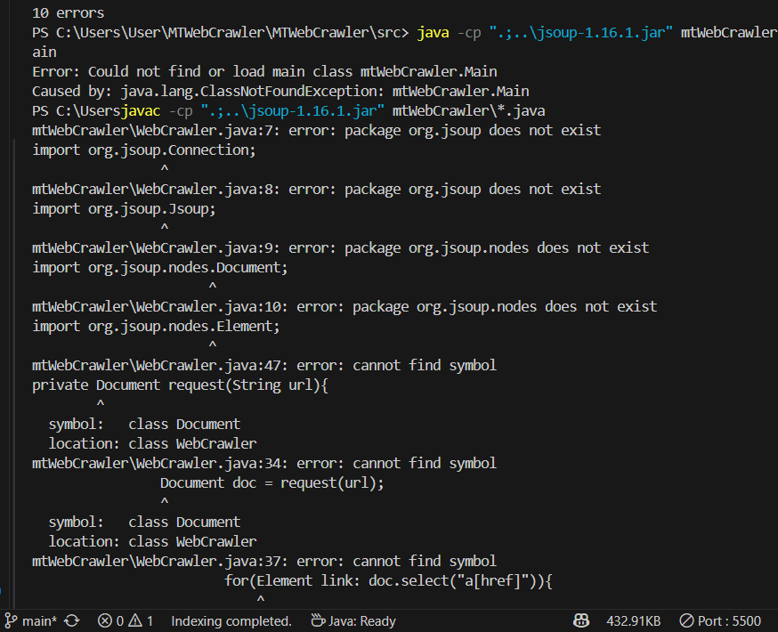
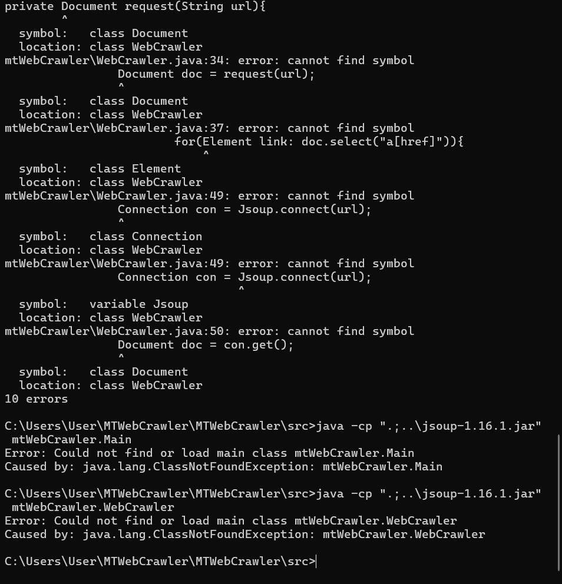
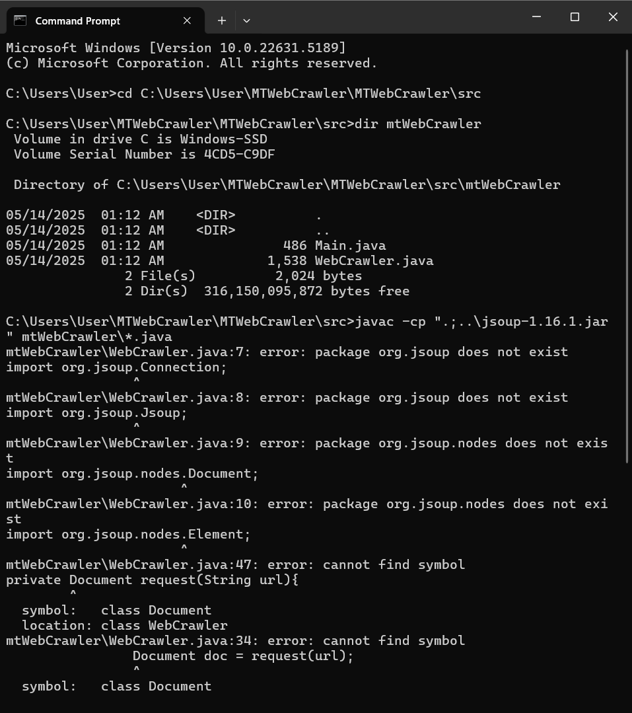
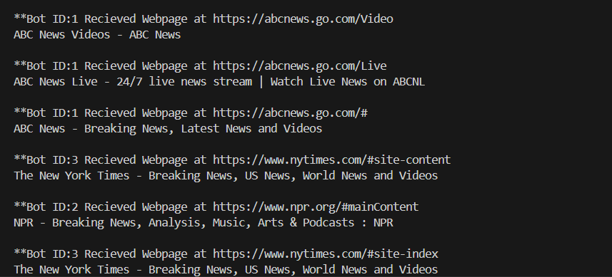
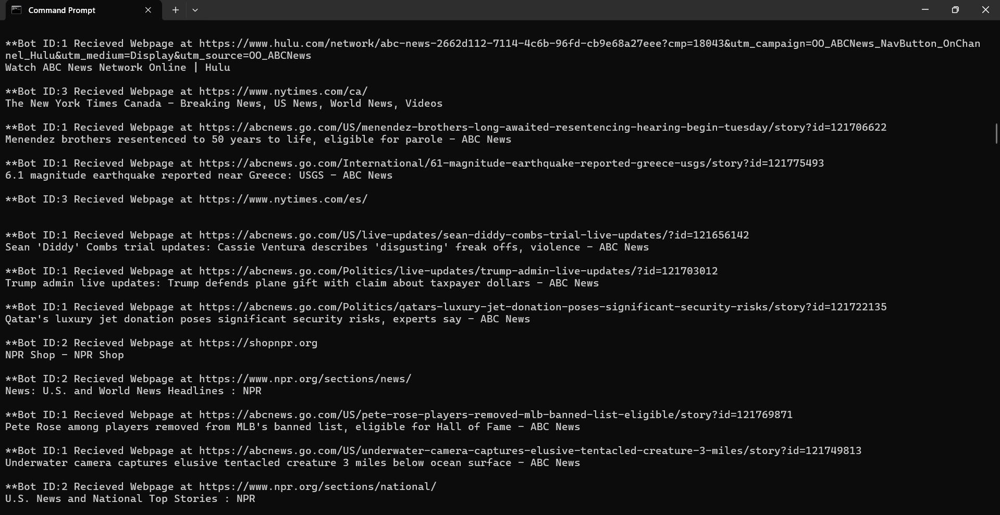

# 🕷️ MTWebCrawler

**MTWebCrawler** is a lightweight Java-based multithreaded web crawler that simulates bots scanning a website and extracting visible links from each page. It’s designed for simplicity, speed, and multithreaded efficiency using the [JSoup](https://jsoup.org/) library.

---

## 🚀 Features

- 🔗 Crawls and extracts hyperlinks from a list of starting websites  
- 🤖 Spawns multiple bots (threads) to crawl in parallel  
- 🔁 Prevents re-crawling the same URLs  
- 📃 Displays the webpage titles for each discovered link  
- 🧼 Clean terminal output for easy reading  
- 🧩 Uses JSoup to parse and interact with HTML

---

## 📁 Project Structure

```
MTWebCrawler/
├── jsoup-1.16.1.jar         # JSoup library (HTML parser)
├── src/
│   └── mtWebCrawler/
│       ├── Main.java        # Entry point, initializes and starts bots
│       └── WebCrawler.java  # Bot logic for crawling and link extraction
├── .classpath
├── .project
└── README.md
```

---

## ⚙️ Technologies Used

- Java 8+
- JSoup 1.16.1
- Multithreading (Java `Thread` class)

---

## 🔧 How to Compile & Run

> ✅ Make sure `jsoup-1.16.1.jar` is in the **root** directory next to the `src` folder.

**1. Open Terminal in `MTWebCrawler` Root Directory:**

```bash
cd MTWebCrawler/src
```

**2. Compile the Java files with JSoup included:**

```bash
javac -cp ".;../jsoup-1.16.1.jar" mtWebCrawler/*.java
```

**3. Run the program:**

```bash
java -cp ".;../jsoup-1.16.1.jar" mtWebCrawler.Main
```

---

## 📸 Screenshots

### ▶️ Start & Initial Output


### ⚙️ Bots Crawling


### ✅ Clean Output Example


### 🌍 Diverse Domain Discovery


### 🏁 Completion Output


---

## ✍️ Example Output

```
**Bot ID:1** Received Webpage at https://abcnews.go.com
ABC News – Breaking News, Latest News and Videos

**Bot ID:2** Received Webpage at https://npr.org
NPR – Breaking News, Analysis, Music, Arts & Podcasts

**Bot ID:3** Received Webpage at https://nytimes.com
The New York Times – Breaking News, US News, World News

... (more links printed)
```

---

## 🙌 Acknowledgments

- [JSoup](https://jsoup.org/) for powerful HTML parsing  
- Original design adapted and debugged for multithreading support  
- Inspired by foundational examples in basic web crawling

---

## 🏁 Final Thoughts

> MTWebCrawler is a fast and minimal Java-based web crawler. It demonstrates the power of multithreading and HTML parsing, giving you a glimpse into how real-world crawlers begin mapping the web.

**“Crawl it. Parse it. Own it.”**
